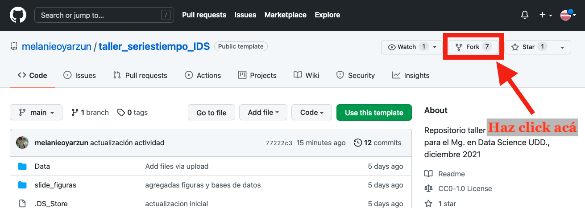
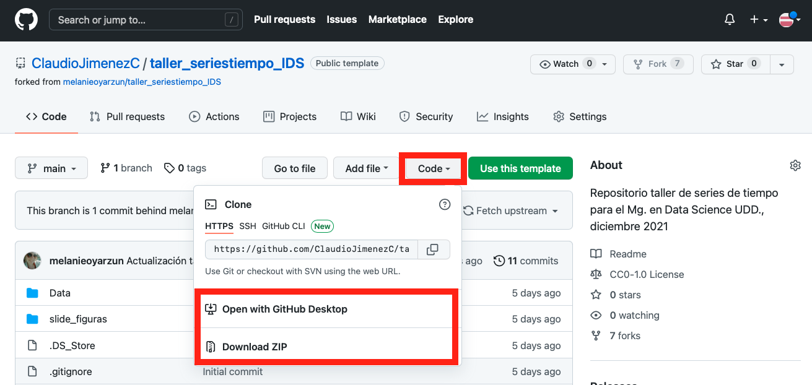
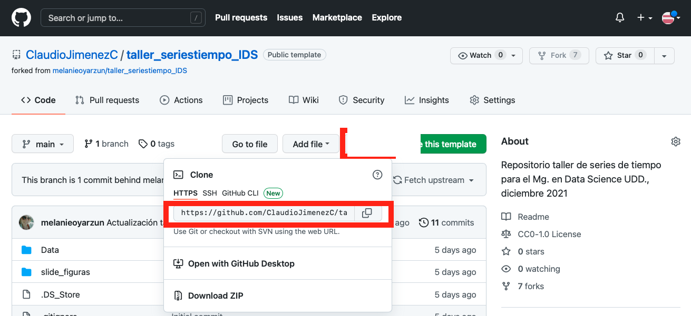
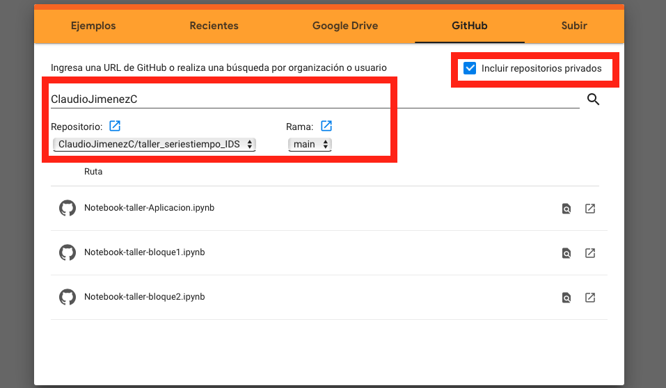
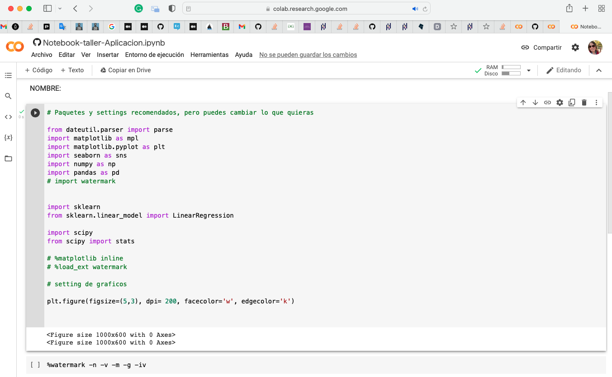
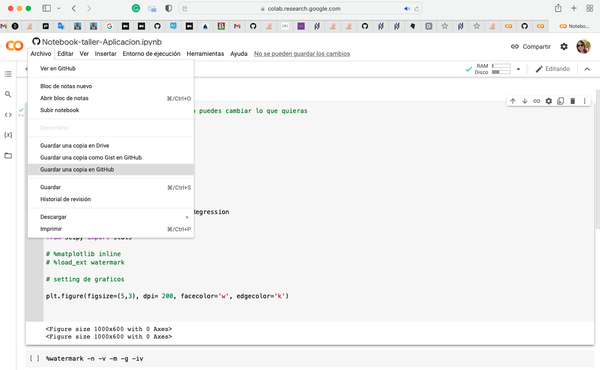

# Taller de Series de Tiempo

Repositorio taller de series de tiempo para el Mg. en Data Science UDD.

Docente: Melanie Oyarzún Wolf (moyarzunw@udd.cl)

## Información sesión:
Martes 7 de diciembre- 18 a 21 hrs
3 horas cronológicas


## Objetivos de aprendizaje

1. Identificar datos de series temporales y sus particularidades, para entender posibles aplicaciones profesionales. [Aplicado en Bloque 1](Notebook-taller-bloque1.ipynb)

2. Describir exploratoriamente una serie temporal, para extraer características claves del fenómeno que permita su modelamiento. [Aplicado en Bloque 2](Notebook-taller-bloque2.ipynb)

3. Modelar series temporales, evaluando alternativas. [Aplicado en Bloque 2](Notebook-taller-bloque2.ipynb)

## Metodología:

El taller se organizará en dos bloques, respondiendo cada uno a uno de los objetivos de aprendizaje descritos anteriormente. En cada bloque se combinará una exposición de los principales contenidos, junto al desarrollo de ejemplos pertinentes en codigo python, con el notebook que acompaña a cada sesión. 

En este repositorio, se encuentran los contenidos, los notebooks y las bases de datos relevantes.

## Evaluación:

Este taller tiene una evaluación con contra de 1 a 7, en realizar la actividad descrita en [Notebook aplicación](Notebook-taller-Aplicacion.ipynb).

Este consiste en usar datos de la API del Banco Mundial para extraer una serie de tiempo de información real de un país a elección y realizar sobre ella el formateo de los datos y un analisis aplicando los contenidos revisados en el taller.

Se desarrolla de manera individual o en grupos de hasta 3 personas.


## Guia: Acceso y edición del repositorio

Para el trabajo en la sesión, se recomienda trabajar en una copia personal de este repositorio. Para esto, recomiendo crear un "fork" en tu propia cuenta de github (esto para poder editarlo facilmente y también poder actualizarlo facilmente).

1. Log in (o registrarse) en [https://github.com](https://github.com)
2. Entrar al repositorio del curso [https://github.com/melanieoyarzun/taller_seriestiempo_IDS](https://github.com/melanieoyarzun/taller_seriestiempo_IDS)
3. Realizar un fork 
   


### opcion 1: Clonar directamente en su equipo y trabajar desde ahi

4. Desde tu Fork, usa la pestaña code para tener acceso directamente a los archivos de la carpeta y editarlos localmente ( decsargar .zip) o abrir con github desktop




### opción 2: Acceder al repositorio desde Google Colab

(Una guia más completa esta en)

4. Desde tu Fork, usa la pestaña code para tener acceso directamente al link del repositorio




5. Logueado en tu cuenta google, entra a [https://colab.research.google.com/github](https://colab.research.google.com/github) y peqga la url del repositorio y haz clicj en incluir repositorios privados



6. Elige el notebook correcto y tendras acceso al que desees



7. Para guardar cambios, puedes hacerlo en tu git, o una copia en drive.



**NOTA IMPORTANTE:**

En colab, los accesos directos a las dependencias de carpeta puede que no funcionen. Si es asi, cada vez que se cargan datos hay una segunda ocpion de acceso que esta comentada.

Basta con comentar la que esta a ka carpeta y descomentar la con acceso web.

Ejemplo:

En el codigo original:

```
#cargamos los datos
DJIA = pd.read_csv('data/DJIA.csv', parse_dates=['DATE'], na_values='.').dropna()


# Nota: si no les reconoce bien la dependencia de la carpeta, pueden usar también

# DJIA = pd.read_csv('https://github.com/melanieoyarzun/taller_seriestiempo_IDS/blob/8c0b9774be8d4103da3801d3069d82b4fe006461/Data/DJIA.csv?raw=true', parse_dates=['DATE'], na_values='.').dropna()

DJIA.info()
```

Version que si funcionaría:

```
#cargamos los datos
#DJIA = pd.read_csv('data/DJIA.csv', parse_dates=['DATE'], na_values='.').dropna()


# Nota: si no les reconoce bien la dependencia de la carpeta, pueden usar también

DJIA = pd.read_csv('https://github.com/melanieoyarzun/taller_seriestiempo_IDS/blob/8c0b9774be8d4103da3801d3069d82b4fe006461/Data/DJIA.csv?raw=true', parse_dates=['DATE'], na_values='.').dropna()

DJIA.info()
```
