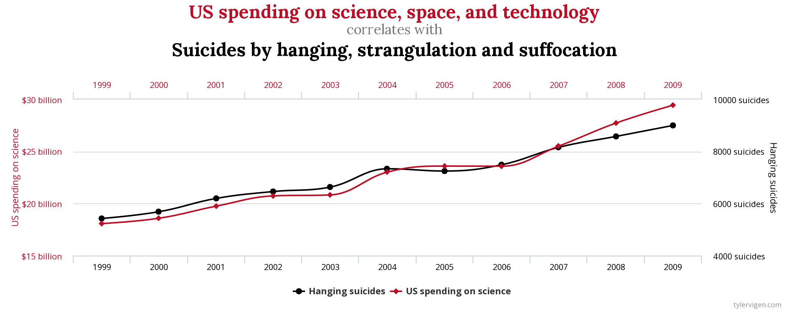

# Taller de Series de Tiempo

Repositorio taller de series de tiempo para el Mg. en Data Science UDD.

Docente: Melanie Oyarzún Wolf

## Información sesión:
Martes 7 de diciembre- 18 a 21 hrs
3 horas cronológicas

3 bloques:
- B1: 18:00 a 18:50hrs
- B2: 19:00 a 19:50hrs
- B3:  20:00 a 21:00hrs

## Objetivos de aprendizaje

1. Identificar datos de series temporales y sus particularidades, para entender posibles aplicaciones profesionales.

2. Describir exploratoriamente una serie temporal, para extraer características claves del fenómeno que permita su modelamiento.

3. Modelar series temporales, evaluando alternativas.

## Metodología:

El taller se organizará en tres bloques, respondiendo cada uno a uno de los objetivos de aprendizaje descritos anteriormente. En cada bloque se combinará una exposición de los principales contenidos, junto al desarrollo de ejemplos pertinentes en codigo python, con el notebook que acompaña a cada sesión. 

En este repositorio, se encuentran las slides de los contenidos, los notebooks y las bases de datos relevantes.

